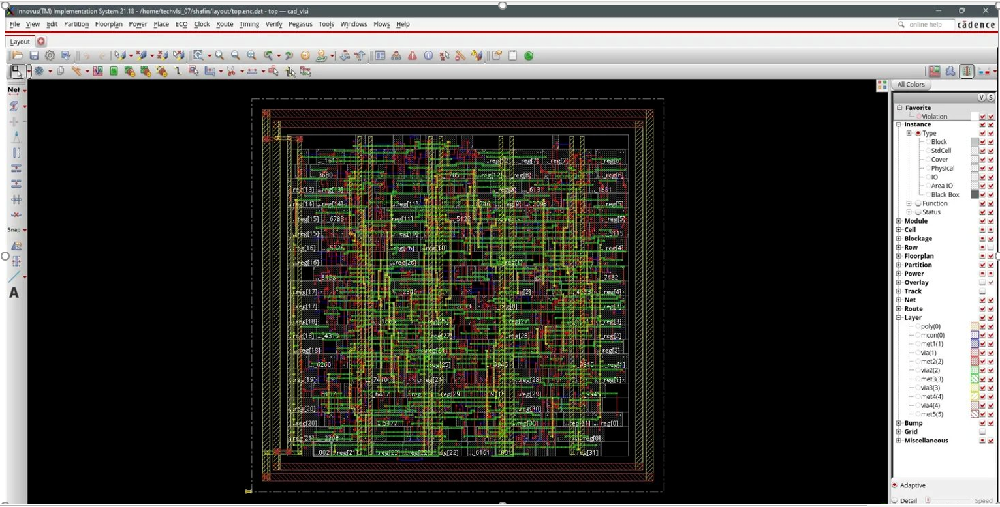
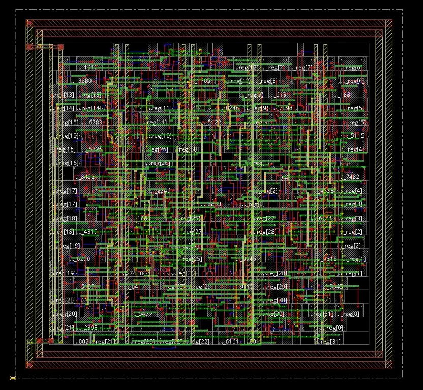
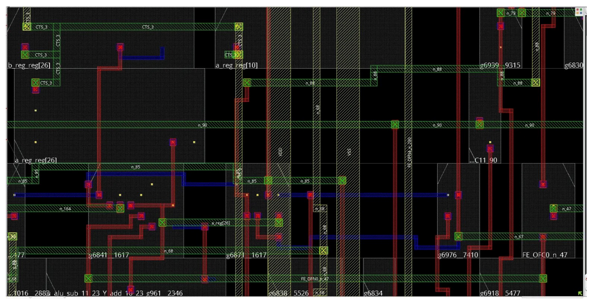
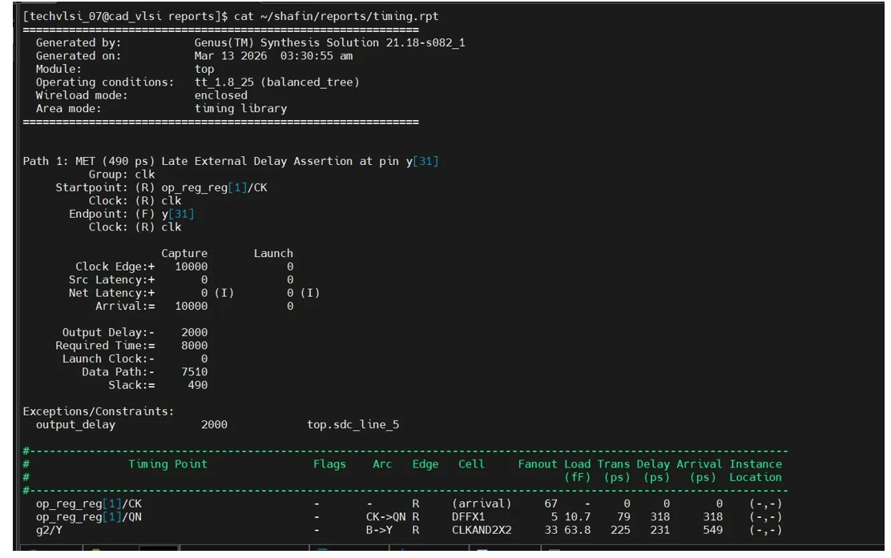
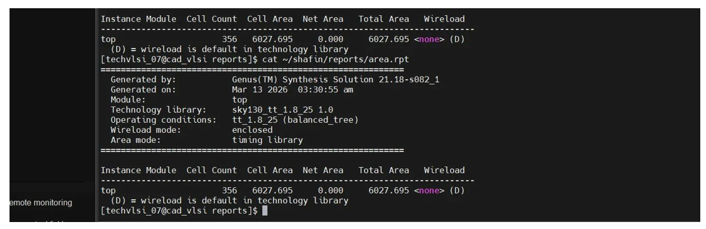
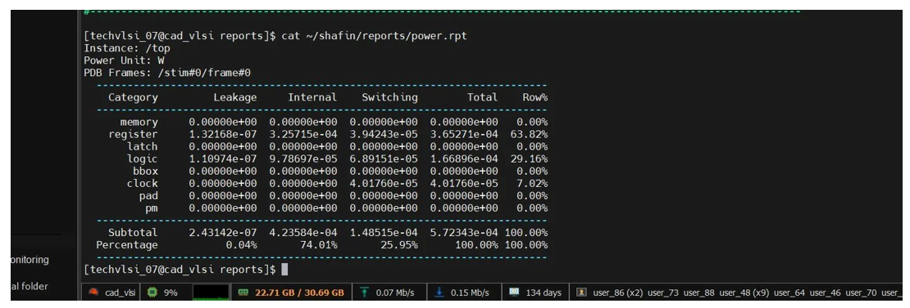

# 32-bit ALU RTL-to-GDSII Implementation (SKY130, Cadence Innovus)

## Overview

This project demonstrates a complete RTL-to-GDSII ASIC physical design flow using Cadence Innovus and the SKY130 standard cell library.

The design is a 32-bit Arithmetic Logic Unit (ALU) with registered inputs. Starting from a synthesized gate-level netlist, the design is taken through all major backend stages including floorplanning, power planning, placement, clock tree synthesis (CTS), routing, and final GDSII generation.

The goal of this project was to understand how a digital design is physically implemented on silicon using an industry-standard tool and an open-source PDK.

---

## Tools and Technology

- Cadence Genus – logic synthesis  
- Cadence Innovus – physical design (P&R)  
- SKY130 PDK – 130nm technology  
- TCL scripts – flow automation  

---

## Design Details

- Design: 32-bit ALU  
- Architecture: Registered inputs + combinational ALU  
- Technology node: 130nm (SKY130)  
- Flow: RTL → Netlist → GDSII  

---

## Physical Design Flow

The following steps were implemented:

1. Library setup (LEF, LIB, GDS mapping)  
2. Design initialization and constraint loading  
3. Floorplanning (core area and utilization setup)  
4. Power planning (power rings and stripes)  
5. Placement and pre-CTS optimization  
6. Clock Tree Synthesis (CTS)  
7. Routing (multi-layer metal routing)  
8. GDSII generation  

---

## Results

- Timing: Met (Slack: +490 ps)  
- Total Area: ~6027 µm²  
- Total Power: ~572 µW  
- Standard Cells: 368  
- Routing Layers: 5 (met1–met5)  
- DRC: No critical errors  

---

## Layout Images

### Full Layout

### Zoomed Layout

### Routing Detail

---

## Reports

### Timing Report

### Area Report

### Power Report

---

## Project Structure
rtl/ Verilog RTL
constraints/ SDC constraints
synthesis/ Gate-level netlist
scripts/ Innovus and MMMC TCL scripts
reports/ Area, timing, and power reports
gds/ Final GDSII layout
images/ Screenshots used in README

---

## Conclusion

This project successfully demonstrates a complete backend ASIC implementation flow using Cadence Innovus and SKY130 technology. It provides hands-on experience with real physical design stages and shows how RTL designs are transformed into manufacturable layouts.
